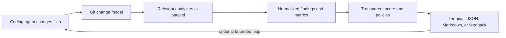

# AgentGuard

AgentGuard is a local-first quality gate for code produced by coding agents. AI coding agents are excellent generators, but they should not be their own quality-control system. AgentGuard uses deterministic software-engineering tools as an independent verification layer.

It inspects the current Git change, runs only relevant analyzers, normalizes their output, explains regressions, and evaluates explicit policies. Optional Codex and Claude Code adapters can feed focused remediation back to an agent; AgentGuard never silently commits.

> **Project status:** early development. Interfaces and the JSON schema may change before the first stable release.

## Quick start

Python 3.12 or newer is required.

```bash
git clone <repository-url>
cd AgentGuard
python -m pip install -e .
agentguard init
agentguard check
```

The PyPI distribution name `agentguard` returned 404 when checked on 31 August 2026, but several similarly branded projects already publish confusing `pip install agentguard` instructions. This project therefore reserves the intended distribution name **`agentguard-quality`** while retaining the `agentguard` command and Python package. Package availability must be checked again immediately before release.

## Commands

```text
agentguard init                  Generate .agentguard.yml
agentguard check                Check working-tree changes
agentguard check --staged       Check staged changes
agentguard check --diff HEAD~1  Check changes since a revision
agentguard compare main         Compare the current tree with main
agentguard feedback             Emit concise agent-facing remediation
agentguard fix                  Run a bounded analyze/repair loop
agentguard doctor               Show available optional analyzers
agentguard version              Show the installed version
```

Use `--format terminal` for a prioritized Rich report or `--format json` for automation. Exact options are available from `agentguard <command> --help`.

## How it works



AgentGuard prefers machine-readable analyzer output and distinguishes security, testing, architecture, complexity, duplication, dependency, typing, and lint findings. Missing optional executables are reported with installation guidance instead of crashing the run.

## Analyzer support

| Area | Integrations | Required? |
| --- | --- | --- |
| Python | Ruff, mypy, Radon, pytest, coverage.py | Optional |
| JavaScript/TypeScript | ESLint, OXC, TypeScript, Vitest/Jest | Optional |
| Security | Bandit, Semgrep, Trivy | Optional |
| Dependencies | Python manifests and JS package/lock files | Built in |
| Duplication | jscpd | Optional |
| Architecture | imports, file/function size, complexity, forbidden dependencies | Built in/configured |

Availability and exact behavior are documented in [docs/analyzers.md](docs/analyzers.md).

## Configuration

```yaml
version: 1
quality:
  minimum_score: 80
complexity:
  max_function_complexity: 15
  max_complexity_increase: 10
tests:
  require_pass: true
  max_coverage_drop: 1.0
security:
  fail_on: [critical, high]
dependencies:
  max_new_dependencies: 3
  forbidden: [lodash]
duplication:
  max_new_blocks: 2
architecture:
  max_file_lines: 500
  max_function_lines: 80
  forbidden_imports:
    - from: domain
      to: infrastructure
agent:
  provider: codex
  max_iterations: 5
```

See [configuration](docs/configuration.md), [architecture](docs/architecture.md), [agent loop](docs/agent-loop.md), [benchmarking](docs/benchmarking.md), and [GitHub Actions](docs/github-actions.md).

## Quality score

The score begins at 100 and subtracts documented penalties for regressions and failures. Failing tests and security issues carry the greatest penalties; lint, complexity, coverage, duplication, architecture, and dependency growth remain visible components. The report exposes every component so the score is reproducible rather than a mystery number. Policies are evaluated independently: a high numeric score cannot override a configured hard gate.

## CI

```yaml
- uses: actions/checkout@v4
  with:
    fetch-depth: 0
- uses: ./
  with:
    base-ref: ${{ github.event.pull_request.base.sha }}
```

For a published action, replace `./` with its repository and version. PR comments require explicit `pull-requests: write`; Markdown can also be uploaded without granting write access.

## Benchmarks

Benchmark records contain repository/revision identity, task and patch inputs, analyzer measurements, and repair iterations. Aggregation reports only observed data. Included examples are marked synthetic and are not product-performance claims.

## Contributing and security

Read [CONTRIBUTING.md](CONTRIBUTING.md) and [SECURITY.md](SECURITY.md). AgentGuard is licensed under [Apache-2.0](LICENSE).

## Roadmap

- Stabilize the normalized JSON schema and plugin API.
- Validate cross-platform analyzer invocation on real repositories.
- Publish repeatable public benchmark datasets.
- Publish the `agentguard-quality` distribution and versioned GitHub Action.
