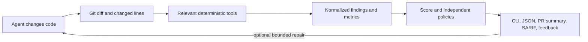

# AgentGuard

[](https://github.com/MaheshBhushan/AgentGuard/actions/workflows/ci.yml)
[](https://www.python.org/downloads/)
[](LICENSE)

**Deterministic quality gates for AI-generated code.** Coding agents are excellent generators; they should not be their own quality-control system. AgentGuard runs established software-engineering tools as an independent, local-first verification layer.

Add it to a pull request workflow:

```yaml
name: AgentGuard

on:
  pull_request:

permissions:
  contents: read

jobs:
  quality:
    runs-on: ubuntu-latest
    steps:
      - uses: actions/checkout@v4
        with:
          fetch-depth: 0
      - uses: MaheshBhushan/AgentGuard@v1
```

AgentGuard detects the PR base and changed languages, installs the pinned `auto` analyzer profile, runs relevant checks, writes a GitHub step summary, and fails on `fail`, `incomplete`, or `error`. No API key or hosted AgentGuard account is required.

## What you get

- Diff-aware analysis for working trees, staged changes, commits, branches, and pull requests
- Normalized findings from lint, typing, complexity, tests, security, dependencies, duplication, and architecture tools
- A transparent 0–100 score plus independent hard policy gates
- Explicit `pass`, `fail`, `incomplete`, `error`, and `skipped` outcomes
- Rich terminal, stable JSON 1.x, GitHub Markdown, SARIF, and concise agent-feedback output
- Optional, bounded Codex CLI or Claude Code repair loops that never commit or push



## Real output

This condensed terminal transcript was generated from commit [`f01c2bd`](https://github.com/MaheshBhushan/AgentGuard/commit/f01c2bd) with the `minimal` profile; elapsed time varies by machine.

```text
AGENTGUARD CHANGE QUALITY REPORT

Quality Score            89 / 100
Changed files            13
Lines                    +143 / -1
Architecture Violations  1
Dependency Count Delta   0
New Dependencies         0
Verdict                  SAFE TO MERGE

Completed in 0.08s
```

The corresponding GitHub summary begins:

```text
AgentGuard Change Quality Report
Quality score: 89 / 100   Verdict: pass   Analysis completeness: 100%

Quality gates
minimum_score       Pass   score 89 must be at least 80
complexity_increase Pass   complexity increase limit
coverage_drop       Pass   coverage drop limit
new_dependencies    Pass   new dependency limit
duplication         Pass   new duplicate block limit
tests_pass          Pass   tests must pass
security            Pass   no blocked security findings
```

Agent feedback is deliberately narrower than a generic review. This output came from commit [`978bb99`](https://github.com/MaheshBhushan/AgentGuard/commit/978bb99):

```text
Fix only these regressions introduced by the current patch:
- agentguard/analyzers/architecture/analyzer.py:42 [max-function-lines]:
  Extract a cohesive helper from this function.
Preserve observable behavior and do not rewrite unrelated code.
```

## Local CLI

Python 3.12 or newer is required. Until the first PyPI release, install from source:

```bash
git clone https://github.com/MaheshBhushan/AgentGuard.git
cd AgentGuard
python -m pip install -e .
agentguard init
agentguard check
```

```text
agentguard init                  Generate .agentguard.yml
agentguard check                 Check working-tree changes
agentguard check --staged        Check staged changes
agentguard check --diff HEAD~1   Check changes since a revision
agentguard compare main          Compare the current tree with main
agentguard feedback              Emit focused remediation instructions
agentguard fix                   Run the bounded analyze/repair loop
agentguard doctor                Show available optional analyzers
agentguard version               Show the installed version
```

Use `--format terminal` for the prioritized Rich report or `--format json` for the [versioned machine contract](docs/json-output.md).

## Analyzer profiles

| Profile | Deterministic scope |
|---|---|
| `auto` | Detect Python and JS/TS projects and select their relevant tools |
| `minimal` | Built-in dependency delta and architecture rules; no external installation |
| `python` | Ruff, mypy, Radon, pytest/coverage, Bandit, plus built-ins |
| `typescript` | ESLint, OXC, `tsc`, Vitest/Jest detection, dependency-cruiser, plus built-ins |
| `security` | Bandit, Semgrep, Trivy, plus built-ins |
| `full` | All registered families, including jscpd duplication checks |

Managed profile packages are version-pinned. A required analyzer that cannot run produces `incomplete`, not a clean pass. Trivy remains a platform-installed binary. See the exact integrations and pins in [Analyzer support](docs/analyzers.md).

## Policies and outcomes

Repository policy lives in strict, versioned [`.agentguard.yml`](docs/configuration.md):

```yaml
version: 1
quality:
  minimum_score: 80
complexity:
  max_function_complexity: 15
  max_complexity_increase: 10
tests:
  require_pass: true
  max_coverage_drop: 1.0
security:
  fail_on: [critical, high]
dependencies:
  max_new_dependencies: 3
duplication:
  max_new_blocks: 2
```

| Outcome | Exit | Meaning |
|---|---:|---|
| `pass` | 0 | Required analysis completed and policies passed |
| `skipped` | 0 | No relevant change was available to analyze |
| `fail` | 1 | Analysis completed and at least one policy failed |
| `error` | 2 | AgentGuard or an analyzer failed |
| `incomplete` | 3 | A required analyzer was unavailable |

The score starts at 100 and exposes each penalty; hard policy results remain independent of that number. Configuration and report JSON Schemas are checked in under [`schemas/`](schemas/).

## GitHub-native options

```yaml
- uses: MaheshBhushan/AgentGuard@v1
  with:
    profile: auto
    minimum-score: "85"
    post-comment: "true"
    annotations: "true"
    upload-report: "true"
```

PR comments require `pull-requests: write`; SARIF upload requires `security-events: write`. Both default off, so the basic workflow remains read-only. Fork PRs without write permission still receive analysis and a step summary. JSON artifacts, Action inputs/outputs, permissions, and shallow-history behavior are documented in [GitHub Actions](docs/github-actions.md).

## Trust and privacy

- AgentGuard itself does not upload source. Reports remain on the developer machine or GitHub runner unless the workflow explicitly uploads an artifact, SARIF, or PR comment; separately installed analyzers retain their own documented network behavior.
- Normal analysis does not call an LLM and needs no model-provider credential.
- External tools run as argument vectors with timeouts; AgentGuard does not use `shell=True` for analyzer execution.
- Missing required tools and malformed analyzer output are visible outcomes, never silent passes.
- `agentguard fix` is opt-in, bounded by iterations and time, and requires a locally authenticated Codex or Claude CLI.
- Repository configuration is untrusted input: unknown keys fail validation and commands are represented as argument arrays.

## How AgentGuard fits

This table describes primary product focus, not an exclusivity claim.

| Tool | Primary focus | Local use | AI-specific workflow |
|---|---|---:|---:|
| AgentGuard | Patch regressions, normalized cross-tool metrics, policies, agent feedback | Yes | Yes |
| [Super-Linter](https://github.com/super-linter/super-linter) | Broad collection of linters and formatters; can validate changed files | Yes | No stated AI specialization |
| [Codex Guard](https://github.com/marketplace/actions/codex-guard-pr-quality-gate) | Deterministic hygiene gates for agent PRs, including added-line markers, secrets, commits, and CI state | Yes | Yes |
| [GitHub CodeQL](https://github.com/github/codeql-action) | Semantic security analysis and GitHub code-scanning integration | CLI/Action | No stated AI specialization |
| LLM review bots | Probabilistic, natural-language review | Provider-dependent | Usually |

AgentGuard complements rather than replaces those tools: it can normalize supported analyzer results and publish compatible findings through [GitHub SARIF code scanning](https://docs.github.com/en/code-security/concepts/code-scanning/sarif-files).

## Release benchmark

The checked-in [release report](benchmarks/release-report.md) is derived from ten pinned, real agent-generated commits in this repository. The current evidence measures only the built-in `minimal` profile: 10 patches, 100% completion among applicable analyzers, and a locally observed median runtime recorded in the report. It contains no recorded repair runs, no false-positive review, and no measurements for complexity, tests, coverage, duplication, or security; those fields remain `N/A` rather than becoming claims.

Regenerate it with:

```bash
python scripts/collect_release_benchmarks.py
```

See the [methodology and performance budgets](docs/benchmarking.md).

## Limitations

- Language-focused profiles currently target Python and JavaScript/TypeScript; broader language support comes from individual security or duplication tools, not deep native integration.
- Accurate branch and PR comparison requires enough Git history to calculate a merge base (`fetch-depth: 0` is recommended).
- Coverage and before/after metrics depend on what the underlying project and installed tools expose.
- The release benchmark demonstrates reproducibility and runtime, not that AgentGuard improves patches.
- Optional comments and code-scanning uploads depend on GitHub token permissions; fork workflows commonly restrict them.
- The public `v1` workflow works after the `v1` release tag is published. Source installs remain available before that release.

## Documentation

- [Architecture](docs/architecture.md)
- [Configuration](docs/configuration.md)
- [Analyzers and profiles](docs/analyzers.md)
- [JSON output](docs/json-output.md)
- [Agent repair loop](docs/agent-loop.md)
- [GitHub Actions](docs/github-actions.md)
- [Benchmarking](docs/benchmarking.md)
- [Contributing](CONTRIBUTING.md)
- [Security policy](SECURITY.md)

AgentGuard is licensed under [Apache-2.0](LICENSE). Repository launch metadata is tracked in [the publication checklist](docs/repository-metadata.md).
