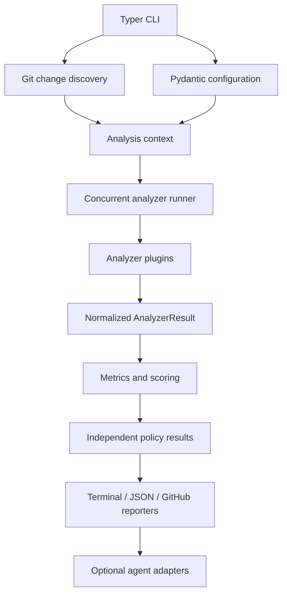

# Architecture

AgentGuard separates repository discovery, tool execution, normalization, evaluation, and presentation. The core has no coding-agent provider dependency.

The Git layer models working-tree, staged, revision, and branch comparisons, including line ranges, additions/deletions, renames, and deletions. Analyzers receive an immutable context and return normalized results rather than printing directly. The runner filters by changed language and executable availability, applies timeouts, and may run independent tools concurrently.

An analyzer plugin declares its name, category, supported languages, executable requirements, version/availability information, and an analysis operation. An unavailable optional analyzer returns a skipped/unavailable result with installation guidance. Extensions should not leak tool-specific structures into policies or reporters.

Findings retain category and severity plus file, line, column, rule identifier, remediation, and metadata. Metrics represent measured values and deltas. A quality report combines repository/change identity, analyzer results, findings, metrics, score breakdown, policies, verdict, and duration.

Before/after measurements may require temporary Git worktrees or reading both blob versions. Implementations must avoid modifying the user's index or working tree. Caches are valid only when their key includes analyzer/version, configuration, relevant file content, and comparison identity.
